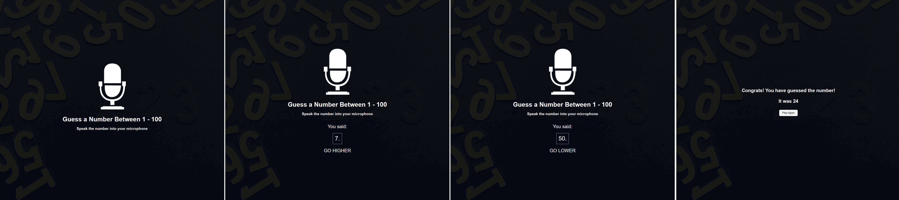

# Udemy--vanillawebprojects-19

**Nineteenth** in a series of **20 small projects** in **Vanilla JavaScript** from the [**Udemy course**](https://www.udemy.com/course/web-projects-with-vanilla-javascript/) by author [Brad Traversy](https://www.traversymedia.com/) with this [Brad's original GitHub repository](https://github.com/bradtraversy/vanillawebprojects).

# 19: Speak Number Guessing Game

Number guessing game where you speak your guess into the microphone using the speech recognition API

## Project Specifications

- Display UI directing user to speak guess
- Implement speech recognition to listen to mic
- Process user's guess and match
- Let user know higher, lower, match or not a number

## Original preview

    

## My solution preview

 

    

## My solution features

- same as an original

# Author

Website - [Petr Bednarski](https://github.com/pettik)  
Frontend Mentor - [@pettik](https://www.frontendmentor.io/profile/pettik)
