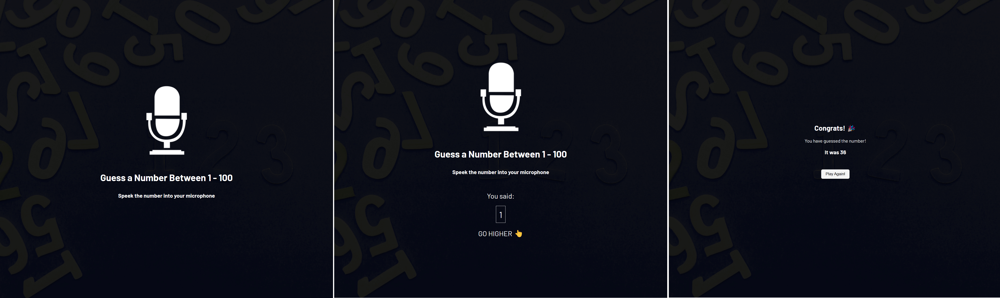

# Udemy--vanillawebprojects-18

**The eighteenth** in a series of **20 small projects** in **Vanilla JavaScript** from the [**Udemy course**](https://www.udemy.com/course/web-projects-with-vanilla-javascript/) by author [Brad Traversy](https://www.traversymedia.com/) with this [Brad's original GitHub repository](https://github.com/bradtraversy/vanillawebprojects).

# 18: New Year Countdown

Landing page that counts down from the current date to the next new year

## Project Specifications

- Create landing page with HTML/CSS
- Calculate the days, hours, mins and seconds to the new year
- Insert values into the DOM
- Show a spinner right before loading the countdown
- Show the coming year in the background

## Original preview

    

## My solution preview

 

    

## My solution features

- same as an original

# Author

Website - [Petr Bednarski](https://github.com/pettik)  
Frontend Mentor - [@pettik](https://www.frontendmentor.io/profile/pettik)
